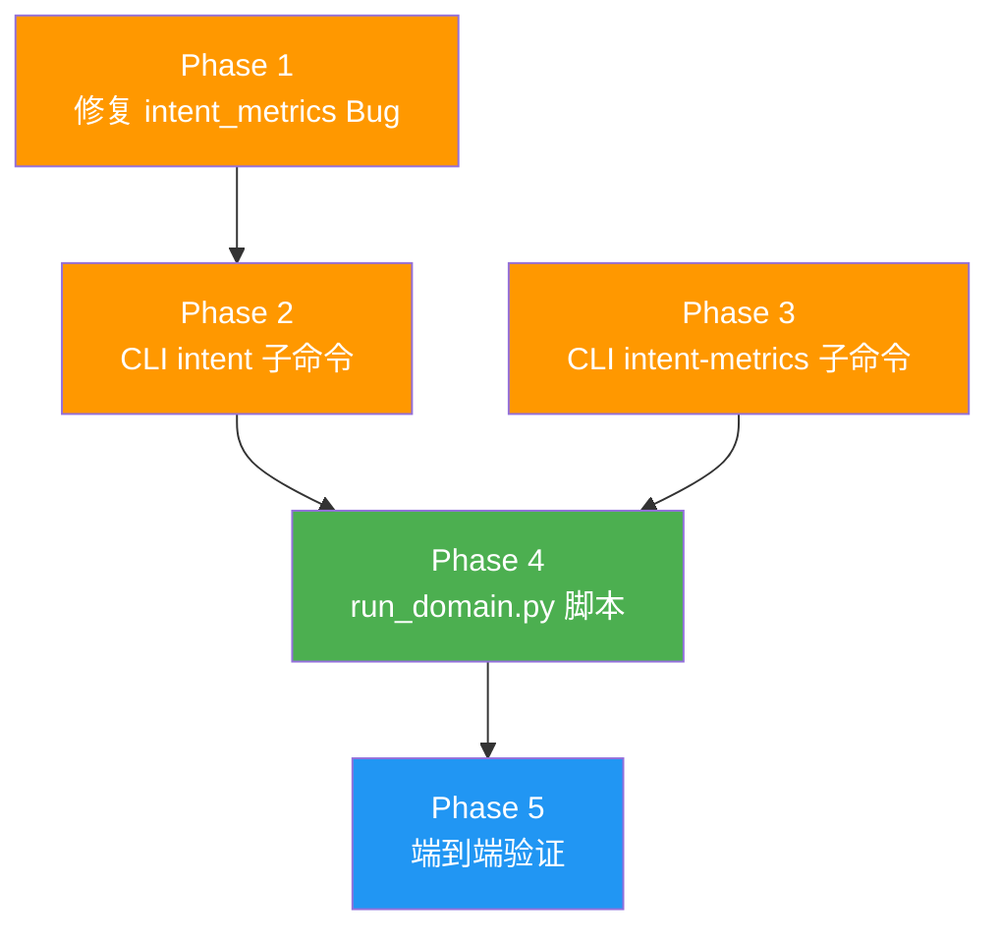

# ArborGraph-Intent: 基于现有 SFTGen 代码库的分步实施计划

## 问题背景

[optimization.md](./optimization.md) 提出了 **ArborGraph-Intent (Domain-Agnostic Tree-of-Graphs Data Synthesis)** 框架，其核心思想是将 Condor（树状知识先验）和 GraphGen（知识图谱引导）两种方法统一为一个"领域无关"的合成数据引擎。该框架包含三个可插拔层：

1. **Macro-Intent 层** — 可插拔任务分类树
2. **Micro-Fact 层** — 通用图谱适配器
3. **Logic-Critic 层** — 抽象符号验证器

当前代码库已具备的能力：
- ✅ 完整的 KG 构建流水线（`read → split → build_kg`）
- ✅ 多种分区策略（[ECE](graphgen/models/partitioner/ece_partitioner.py)、[Hierarchical](graphgen/models/partitioner/hierarchical_partitioner.py)、`Leiden` 等 6 种）
- ✅ 多种生成模式（[atomic](graphgen/operators/generate/generate_qas.py)、`aggregated`、`multi_hop`、`cot`、`hierarchical`）
- ✅ 层次结构序列化（[HierarchySerializer](graphgen/utils/hierarchy_utils.py)）
- ✅ Jinja2 模板系统、批量/并行处理、CLI 工具

**核心差距**：当前系统是"一体化"的，缺乏"可插拔领域配置"机制。ArborGraph-Intent 要求用户仅通过替换"配置包"即可适配新领域。

---

## 当前实施状态

### ✅ 已完成组件

| Phase | 组件 | 状态 | 文件 |
|--------|--------|------|------|
| **Phase 1** | TaxonomyTree | ✅ 完成 | `graphgen/models/taxonomy/taxonomy_tree.py` |
| | DiversitySampler | ✅ 完成 | `graphgen/models/taxonomy/diversity_sampler.py` |
| | AutoTaxonomy | ✅ 完成 | `graphgen/models/taxonomy/auto_taxonomy.py` |
| | taxonomy_schema.json | ✅ 完成 | `graphgen/configs/schemas/taxonomy_schema.json` |
| **Phase 2** | BaseGraphAdapter | ✅ 完成 | `graphgen/bases/base_graph_adapter.py` |
| | NetworkXGraphAdapter | ✅ 完成 | `graphgen/models/graph_adapter/networkx_adapter.py` |
| | IntentGraphLinker | ✅ 完成 | `graphgen/models/graph_adapter/intent_graph_linker.py` |
| **Phase 3** | BaseCritic + CriticResult | ✅ 完成 | `graphgen/bases/base_critic.py` |
| | LLMCritic | ✅ 完成 | `graphgen/models/critic/llm_critic.py` |
| | RuleCritic | ✅ 完成 | `graphgen/models/critic/rule_critic.py` |
| | IntentPipeline | ✅ 完成 | `graphgen/intent_pipeline.py` |
| **Phase 4** | IntentGenerator | ✅ 完成 | `graphgen/models/generator/intent_generator.py` |
| | 认知维度模板 | ✅ 完成 | 内置 6 种认知维度模板 |
| **Phase 5** | 领域配置包 | ✅ 完成 | `graphgen/configs/intent/finance/` 和 `cybersecurity/` |
| | IntentMetrics | ✅ 完成 | `graphgen/utils/intent_metrics.py` |
| | 测试文件 | ✅ 完成 | 6 个测试文件 |
| | Generator 集成 | ✅ 完成 | `generate_qas.py` 中已添加 intent 模式 |

### ❌ 待完成组件

| Phase | 组件 | 状态 | 说明 |
|--------|--------|------|------|
| **Phase 3** | CLI `intent` 子命令 | ❌ 缺失 | 需要在 `arborgraph_cli.py` 中添加 |
| **Phase 6** | CLI `intent-metrics` 子命令 | ❌ 缺失 | 需要在 `arborgraph_eval_cli.py` 中添加 |
| **Phase 5** | `run_domain.py` 脚本 | ❌ 缺失 | 领域实例化批量运行脚本 |
| Bug | `intent_metrics.py` 修复 | ❌ 缺失 | `_get_all_dimensions()` 方法不存在 |

---

## 实施策略

基于代码现状，**大部分核心组件已实现**，剩余工作主要是 **CLI 集成、Bug 修复和完善工具脚本**。

---

## Phase 1: 修复 IntentMetrics 中的 Bug

**目标**：修复 `intent_metrics.py` 中引用的不存在方法。

### 修改文件

#### [MODIFY] `graphgen/models/taxonomy/taxonomy_tree.py`

添加 `_get_all_dimensions()` 方法：

```python
def _get_all_dimensions(self) -> List[str]:
    """Get all cognitive dimensions present in the tree."""
    dimensions = set()
    for node in self._nodes.values():
        if node.cognitive_dimension:
            dimensions.add(node.cognitive_dimension)
    return list(dimensions)
```

### 测试计划

| 测试项 | 方法 | 命令 | 预期结果 |
|--------|------|------|----------|
| Bug 修复验证 | 单元测试 | `python -m pytest tests/test_intent_metrics.py -v` | 通过，无 AttributeError |

---

## Phase 2: 添加 CLI `intent` 子命令

**目标**：在 `arborgraph_cli.py` 中添加 ArborGraph-Intent 模式的独立命令，提供与 `IntentPipeline.from_config()` 的集成。

### 修改文件

#### [MODIFY] `arborgraph_cli.py`

在 CLI 主函数中添加 `intent` 子命令：

```python
@cli.command()
@click.option("--config", "-c", type=click.Path(exists=True), required=True,
              help="Path to intent_config.yaml")
@click.option("--output", "-o", type=click.Path(),
              help="Output file path for generated QA pairs")
@click.option("--input", "-i", type=click.Path(exists=True),
              help="Input JSONL file for KG construction (if not using existing KG)")
@click.option("--count", "-n", type=int, default=100,
              help="Target number of QA pairs to generate")
async def intent(config: str, output: str, input: str, count: int):
    """
    Run ArborGraph-Intent (Domain-Agnostic Tree-of-Graphs) pipeline.

    Generates domain-agnostic SFT data guided by taxonomy tree and knowledge graph.
    """
    # Load config
    with open(config, "r", encoding="utf-8") as f:
        config_data = yaml.safe_load(f)

    intent_config = config_data.get("intent", config_data)

    # Setup LLM client (reuse existing setup code)
    llm_client = await setup_llm_client(config_data)

    # If input provided, build KG first
    graph_storage = None
    if input:
        # Use existing KG building logic
        from arborgraph.arborgraph import GraphGen
        graphgen = ArborGraph()
        graph_storage = await graphgen.build_storage(input, config_data)
    else:
        # Assume KG exists (user must provide storage path or use default)
        raise click.ClickException(
            "Either --input for KG construction or --storage-path for existing KG is required"
        )

    # Create and run pipeline
    pipeline = IntentPipeline.from_config(config, llm_client, graph_storage)

    logger.info(f"Running ArborGraph-Intent pipeline, target: {count} QA pairs")
    results = await pipeline.run(target_count=count, batch_size=intent_config.get("generation", {}).get("batch_size", 10))

    # Write output
    if not output:
        output = intent_config.get("generation", {}).get("output", "intent_output.json")

    with open(output, "w", encoding="utf-8") as f:
        json.dump(results, f, ensure_ascii=False, indent=2)

    logger.info(f"Generated {len(results)} QA pairs, saved to {output}")
```

### 测试计划

| 测试项 | 方法 | 命令 | 预期结果 |
|--------|------|------|----------|
| CLI 帮助 | 手动测试 | `python arborgraph_cli.py intent --help` | 显示正确的帮助信息 |
| 运行完整流程 | 集成测试 | 使用配置文件运行 | 生成 QA 对并保存到输出文件 |

---

## Phase 3: 添加 CLI `intent-metrics` 子命令

**目标**：在 `arborgraph_eval_cli.py` 中添加 ArborGraph-Intent 特定的评测命令。

### 修改文件

#### [MODIFY] `arborgraph_eval_cli.py`

添加 `intent-metrics` 子命令：

```python
@eval_cli.group()
def intent_metrics():
    """ArborGraph-Intent specific evaluation commands."""

@intent_metrics.command()
@click.option("--taxonomy", "-t", type=click.Path(exists=True), required=True,
              help="Path to taxonomy tree JSON/YAML")
@click.option("--results", "-r", type=click.Path(exists=True), required=True,
              help="Path to generated results JSON")
@click.option("--output", "-o", type=click.Path(),
              help="Output path for metrics report (default: stdout)")
def calculate_intent_metrics(taxonomy: str, results: str, output: str):
    """
    Calculate ArborGraph-Intent coverage and distribution metrics.

    Analyzes generated QA pairs to report taxonomy coverage,
    cognitive dimension distribution, and quality scores.
    """
    from arborgraph.models.taxonomy.taxonomy_tree import TaxonomyTree
    from arborgraph.utils.intent_metrics import IntentMetrics

    # Load taxonomy
    tree = TaxonomyTree.load(taxonomy)

    # Create metrics calculator
    metrics = IntentMetrics(tree)

    # Generate report
    report = metrics.generate_report(results, output_path=output)

    # Print summary to console
    import json
    click.echo(json.dumps(report, indent=2, ensure_ascii=False))
```

### 测试计划

| 测试项 | 方法 | 命令 | 预期结果 |
|--------|------|------|----------|
| CLI 帮助 | 手动测试 | `python arborgraph_eval_cli.py intent-metrics --help` | 显示正确的帮助信息 |
| 评测计算 | 集成测试 | 使用测试数据运行 | 输出正确的覆盖率统计 |

---

## Phase 4: 创建领域实例化脚本

**目标**：创建 `scripts/run_domain.py` 脚本，支持批量运行 ArborGraph-Intent 用于不同领域。

### 新增文件

#### [NEW] `scripts/run_domain.py`

```python
"""
Domain instantiation script for ArborGraph-Intent.

Automates the complete workflow for a new domain:
1. Build KG from domain documents
2. Load or auto-generate taxonomy tree
3. Run ArborGraph-Intent pipeline
4. Generate metrics report
"""

import argparse
import asyncio
import logging
import os
import sys
from pathlib import Path
from typing import Optional

import yaml

# Add parent directory to path for imports
sys.path.insert(0, str(Path(__file__).parent.parent))

from arborgraph.intent_pipeline import IntentPipeline
from arborgraph.arborgraph import GraphGen
from arborgraph.models.taxonomy.taxonomy_tree import TaxonomyTree
from arborgraph.models.taxonomy.auto_taxonomy import AutoTaxonomy
from arborgraph.models.storage.networkx_storage import NetworkXStorage
from arborgraph.utils.intent_metrics import IntentMetrics

logger = logging.getLogger(__name__)


async def run_domain(
    domain_dir: str,
    output_dir: Optional[str] = None,
    kg_path: Optional[str] = None,
    generate_taxonomy: bool = False,
    source_document: Optional[str] = None,
):
    """
    Run ArborGraph-Intent pipeline for a domain.

    :param domain_dir: Directory containing domain config
    :param output_dir: Output directory for results
    :param kg_path: Path to existing KG (skip build if provided)
    :param generate_taxonomy: Whether to auto-generate taxonomy from source document
    :param source_document: Path to domain document for auto-taxonomy generation
    """
    domain_dir = Path(domain_dir)
    config_path = domain_dir / "intent_config.yaml"

    if not config_path.exists():
        raise FileNotFoundError(f"intent_config.yaml not found in {domain_dir}")

    # Load config
    with open(config_path, "r", encoding="utf-8") as f:
        config_data = yaml.safe_load(f)

    intent_config = config_data.get("intent", config_data)
    output_dir = Path(output_dir or domain_dir / "output")
    output_dir.mkdir(parents=True, exist_ok=True)

    # Setup LLM client (reuse existing)
    # ... (load from config or environment)

    # Step 1: Build or load KG
    graph_storage = None
    if kg_path:
        logger.info(f"Loading existing KG from {kg_path}")
        graph_storage = NetworkXStorage.load(kg_path)
    else:
        logger.info("Building KG from domain documents...")
        # Use GraphGen to build KG from domain documents
        graphgen = ArborGraph()
        # Find input documents in domain directory
        input_files = list((domain_dir / "sample_data").glob("*.jsonl"))
        if not input_files:
            input_files = list((domain_dir / "sample_data").glob("*.json"))
        if input_files:
            graph_storage = await graphgen.build_storage(str(input_files[0]), config_data)
            kg_path = output_dir / "knowledge_graph.pkl"
            graph_storage.save(str(kg_path))
            logger.info(f"KG saved to {kg_path}")

    # Step 2: Load or generate taxonomy
    taxonomy_path = intent_config.get("taxonomy", {}).get("path")
    if generate_taxonomy and source_document:
        logger.info(f"Auto-generating taxonomy from {source_document}...")
        with open(source_document, "r", encoding="utf-8") as f:
            doc_text = f.read()
        domain_name = intent_config.get("taxonomy", {}).get("domain", "general")
        auto_taxonomy = AutoTaxonomy(llm_client)  # Need llm_client
        tree = await auto_taxonomy.generate_from_document(doc_text, domain_name)
        taxonomy_path = output_dir / "taxonomy_auto.json"
        tree.save(str(taxonomy_path))
        logger.info(f"Taxonomy saved to {taxonomy_path}")
    elif taxonomy_path and os.path.exists(taxonomy_path):
        logger.info(f"Loading taxonomy from {taxonomy_path}")
        tree = TaxonomyTree.load(taxonomy_path)
    else:
        raise ValueError("No taxonomy found. Provide --generate-taxonomy with --source-document")

    # Step 3: Run ArborGraph-Intent pipeline
    logger.info("Running ArborGraph-Intent pipeline...")
    pipeline = IntentPipeline.from_config(str(config_path), llm_client, graph_storage)

    target_count = intent_config.get("generation", {}).get("target_qa_pairs", 100)
    results = await pipeline.run(target_count=target_count)

    # Step 4: Save results
    results_path = output_dir / "qa_pairs.json"
    import json
    with open(results_path, "w", encoding="utf-8") as f:
        json.dump(results, f, indent=2, ensure_ascii=False)
    logger.info(f"Generated {len(results)} QA pairs, saved to {results_path}")

    # Step 5: Generate metrics report
    metrics = IntentMetrics(tree)
    report = metrics.generate_report(str(results_path))
    report_path = output_dir / "metrics_report.json"
    with open(report_path, "w", encoding="utf-8") as f:
        json.dump(report, f, indent=2, ensure_ascii=False)
    logger.info(f"Metrics report saved to {report_path}")

    return results_path, report_path


def main():
    parser = argparse.ArgumentParser(
        description="Run ArborGraph-Intent pipeline for a specific domain"
    )
    parser.add_argument(
        "--domain", "-d", required=True,
        help="Directory containing domain config (e.g., resources/domain_configs/finance)"
    )
    parser.add_argument(
        "--output", "-o",
        help="Output directory for results (default: domain/output)"
    )
    parser.add_argument(
        "--kg", "-k",
        help="Path to existing knowledge graph (skip KG build)"
    )
    parser.add_argument(
        "--generate-taxonomy", "-g", action="store_true",
        help="Auto-generate taxonomy from source document"
    )
    parser.add_argument(
        "--source-document", "-s",
        help="Source document for taxonomy auto-generation"
    )
    parser.add_argument(
        "--verbose", "-v", action="store_true",
        help="Enable verbose logging"
    )

    args = parser.parse_args()

    logging.basicConfig(
        level=logging.DEBUG if args.verbose else logging.INFO,
        format="%(asctime)s - %(name)s - %(levelname)s - %(message)s"
    )

    asyncio.run(run_domain(
        domain_dir=args.domain,
        output_dir=args.output,
        kg_path=args.kg,
        generate_taxonomy=args.generate_taxonomy,
        source_document=args.source_document,
    ))


if __name__ == "__main__":
    main()
```

### 测试计划

| 测试项 | 方法 | 命令 | 预期结果 |
|--------|------|------|----------|
| 脚本帮助 | 手动测试 | `python scripts/run_domain.py --help` | 显示正确的帮助信息 |
| 领域运行 | 集成测试 | 运行 finance 领域 | 生成 QA 对和指标报告 |

---

## 依赖关系与执行顺序



- **Phase 1 必须最先完成**（修复 bug 阻塞其他测试）
- **Phase 2 和 Phase 3 可并行开发**（CLI 命令独立）
- Phase 4 依赖 Phase 2（需要 CLI 集成）
- Phase 5 依赖所有之前 Phase（完整系统测试）

---

## 文件变更总览

| 类型 | 数量 | 说明 |
|------|------|------|
| **修改** | 3 个 Python 文件 | bug 修复 + 2 个 CLI 扩展 |
| **新增** | 1 个 Python 脚本 | `scripts/run_domain.py` |
| **测试** | 3 项验证 | 单元测试 + CLI 帮助 + E2E |

> [!IMPORTANT]
> 所有修改均为**增量式**，不破坏现有 `atomic/aggregated/multi_hop/cot/hierarchical` 模式的任何功能。现有测试应全部保持通过。

---

## Verification Plan

### 自动化测试

每个 Phase 完成后运行：
```bash
# 运行所有现有测试确认无回归
python -m pytest tests/ -v --tb=short

# 运行 ArborGraph-Intent 相关测试
python -m pytest tests/test_taxonomy_tree.py tests/test_graph_adapter.py tests/test_critic.py tests/test_intent_pipeline.py tests/test_intent_generator.py tests/test_intent_metrics.py -v
```

### 端到端验证

```bash
# 使用 run_domain.py 脚本运行金融领域
python scripts/run_domain.py --domain graphgen/configs/intent/finance --output output/finance

# 使用 intent-metrics 评测输出
python arborgraph_eval_cli.py intent-metrics --taxonomy graphgen/configs/intent/finance/taxonomy.json --results output/finance/qa_pairs.json
```

### 回归验证

```bash
# 确认现有功能不受影响
python arborgraph_cli.py --config graphgen/configs/aggregated_config.yaml --input resources/input_examples/jsonl_demo.jsonl --dry-run
```

### 手动验证（需用户执行）

1. **输出检查**：打开生成的 JSON 文件，检查 QA 对是否包含正确的领域知识
2. **格式一致性**：确认金融和安全两个领域的输出 JSON 结构完全一致
3. **多样性抽检**：随机抽取 20 条 QA，确认覆盖不同认知维度

---

## 附录：核心组件概览

### Macro-Intent 层组件

| 组件 | 类/函数 | 位置 |
|--------|----------|------|
| 任务分类树 | `TaxonomyTree` | `graphgen/models/taxonomy/taxonomy_tree.py` |
| 节点数据类 | `TaxonomyNode` | 同上 |
| 多样性采样器 | `DiversitySampler` | `graphgen/models/taxonomy/diversity_sampler.py` |
| 自动分类生成 | `AutoTaxonomy` | `graphgen/models/taxonomy/auto_taxonomy.py` |
| JSON Schema | `taxonomy_schema.json` | `graphgen/configs/schemas/taxonomy_schema.json` |

### Micro-Fact 层组件

| 组件 | 类/函数 | 位置 |
|--------|----------|------|
| 抽象适配器 | `BaseGraphAdapter` | `graphgen/bases/base_graph_adapter.py` |
| NetworkX 适配器 | `NetworkXGraphAdapter` | `graphgen/models/graph_adapter/networkx_adapter.py` |
| 意图-图链接器 | `IntentGraphLinker` | `graphgen/models/graph_adapter/intent_graph_linker.py` |

### Logic-Critic 层组件

| 组件 | 类/函数 | 位置 |
|--------|----------|------|
| 抽象验证器 | `BaseCritic` | `graphgen/bases/base_critic.py` |
| 结果数据类 | `CriticResult` | 同上 |
| LLM 验证器 | `LLMCritic` | `graphgen/models/critic/llm_critic.py` |
| 规则验证器 | `RuleCritic` | `graphgen/models/critic/rule_critic.py` |
| 内置规则 | `min_answer_length`, `min_question_length`, `answer_not_identical_to_question`, `answer_contains_keywords` | 同上 |

### Pipeline 与 Generator

| 组件 | 类/函数 | 位置 |
|--------|----------|------|
| ArborGraph-Intent 管道 | `IntentPipeline` | `graphgen/intent_pipeline.py` |
| ArborGraph-Intent 生成器 | `IntentGenerator` | `graphgen/models/generator/intent_generator.py` |
| 认知维度模板 | `DIMENSION_PROMPTS` | 同上 (6 个维度) |
| 元提示模板 | `META_PROMPT_TEMPLATE` | 同上 |

### 工具与配置

| 组件 | 类/函数 | 位置 |
|--------|----------|------|
| 评估指标 | `IntentMetrics` | `graphgen/utils/intent_metrics.py` |
| 配置模板 | `intent_config.yaml` | `graphgen/configs/intent_config.yaml` |
| 金融配置 | `taxonomy.json`, `intent_config.yaml` | `graphgen/configs/intent/finance/` |
| 安全配置 | `taxonomy.json`, `intent_config.yaml` | `graphgen/configs/intent/cybersecurity/` |
